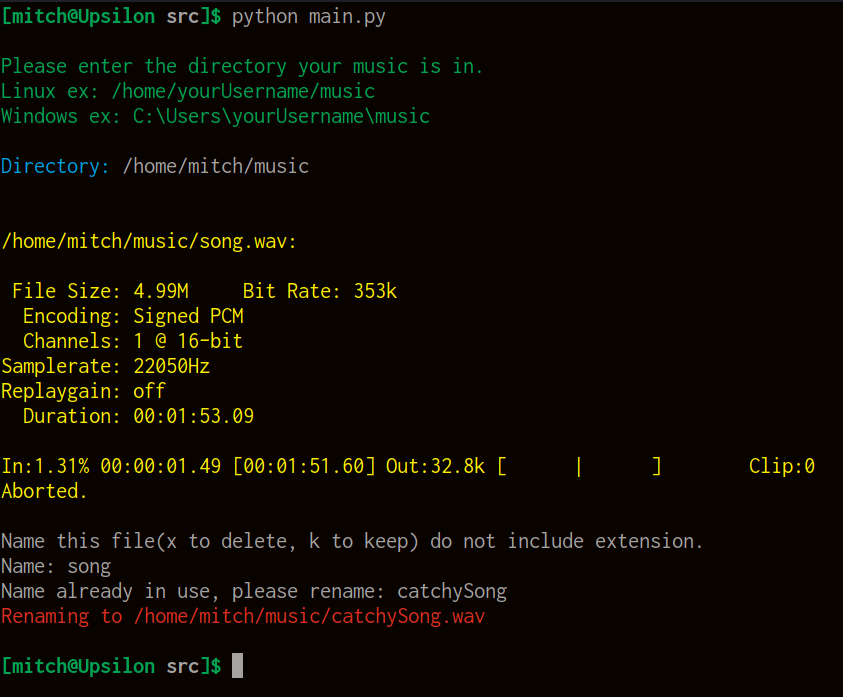
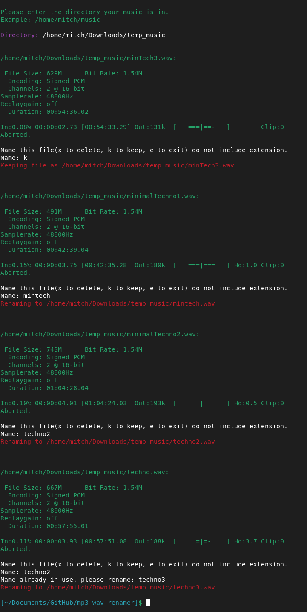

# mp3 + wav renamer

## Overview
I wrote this program to help me organize my mess of a music library.
Each mp3 or wav is read into a list. The list is iterated, playing each track until a keyboard interrupt (CTRL + C).  
The user is then asked to rename the track, delete it, or keep it.
The script will prevent invalid track names, invalid directories, and detect the correct file extensions (mp3 and wav).

## Screenshots

Note that output differs because I use SoX to play the tracks on Linux but use the winsound module in Windows.  
Winsound is not the ideal solution, but it is functional.

**Linux output**  

**Windows output**  

## Dependencies

This script uses the [colorama](https://github.com/tartley/colorama) module which is distributed under the BSD-3-Clause License.   
This script uses [SoX](https://github.com/chirlu/sox) which is distributed under the GPL-2.0 License.
